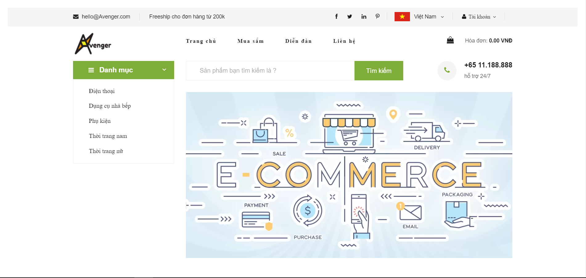
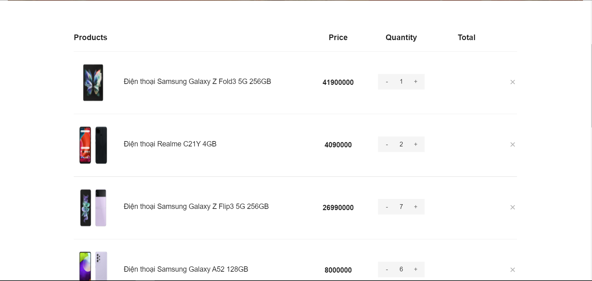
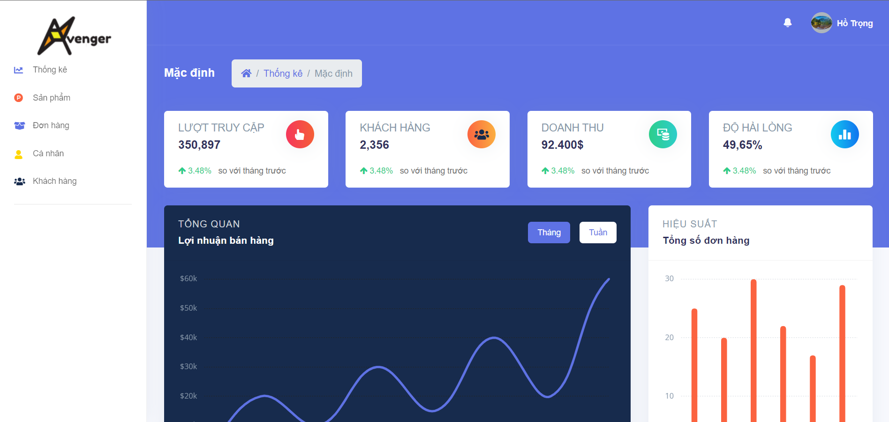
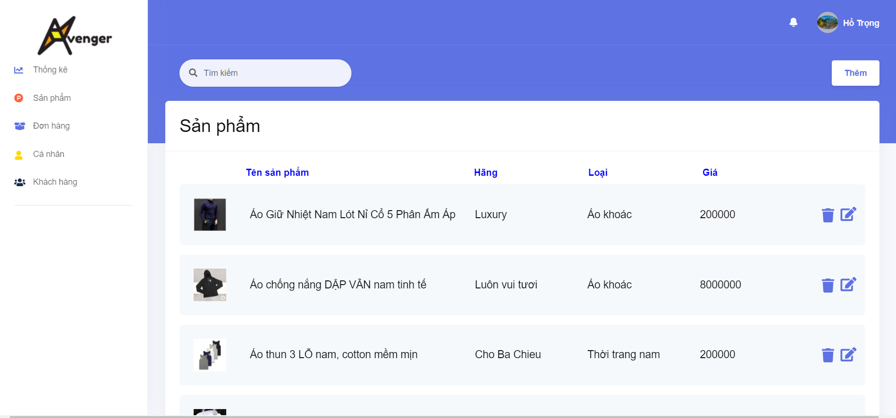
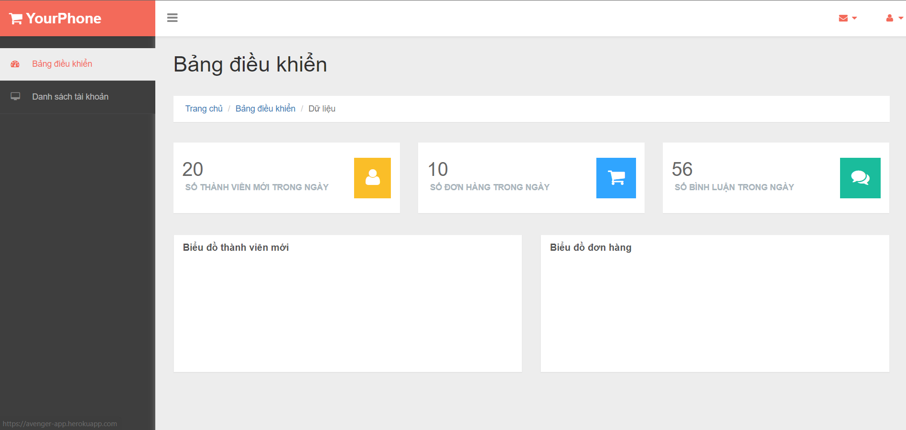
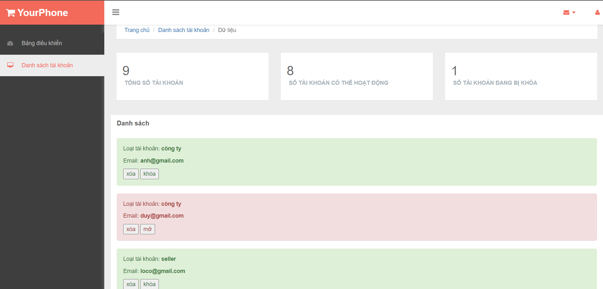

# Avengers-Eshop
Avengers Eshop is an e-commerce web app that makes it easier for people to find and buy things.
## Members:

1. Trương Văn Hoàng - 19120517
2. Nguyễn Anh Minh - 19120584
3. Hồ Hiếu Trọng - 18120618
4. Phạm Duy Minh - 19120588
5. Trần Tấn Lộc - 19120564
## Technologies
    
     

## Deployment 
[Avengers](https://avenger-app.herokuapp.com/)

## Demo Prototype

## Core Features
* Customer can search and add products to cart
* Create bill and send to seller
* Add products to store
* Store profit statistics every month
* Admin can manage accounts (lock, delete)
* Admin can statistics comments, products on web

## Screenshot
Customer

    
    

Seller

    
    

Admin

    
    

## Run

In the project directory, you can run:

## `npm start`

Runs the app in the development mode.\
Open [http://localhost:3000](http://localhost:3000) to view it in your browser.
##### NodeJS is required.
